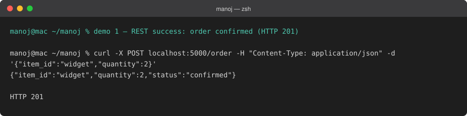
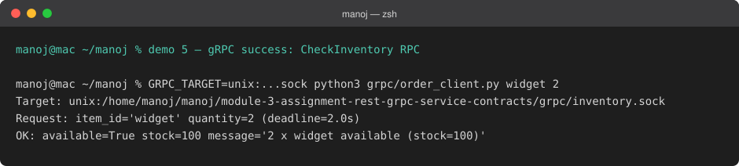
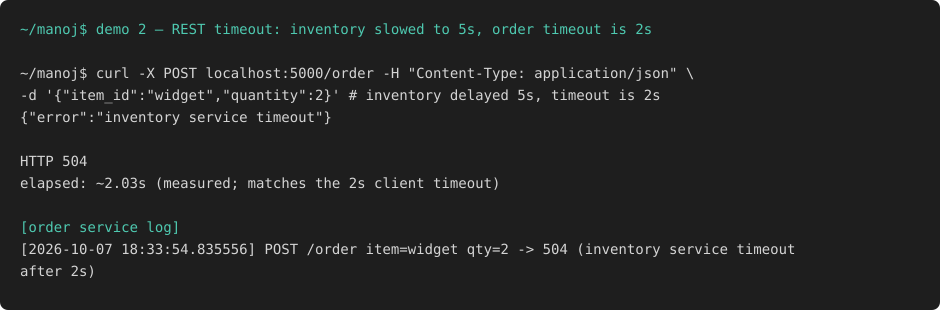
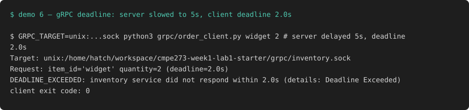
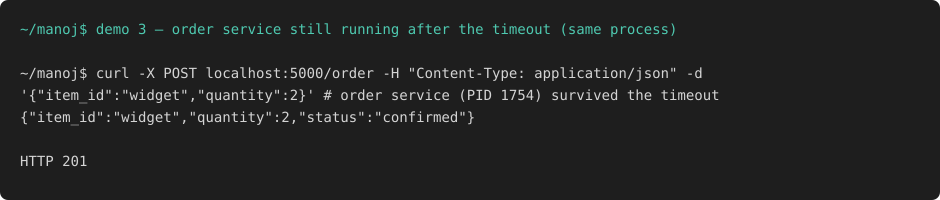
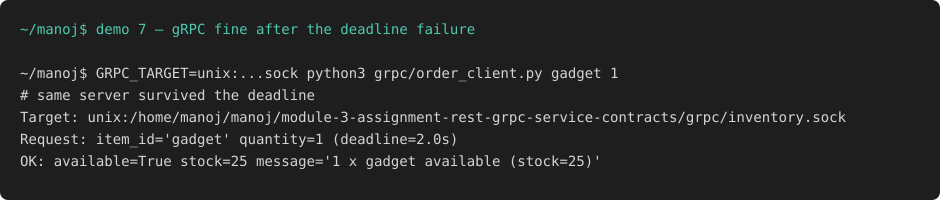
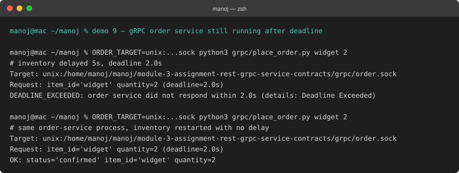
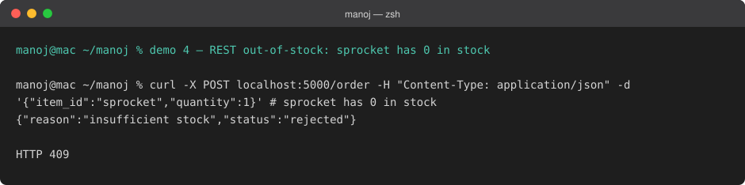
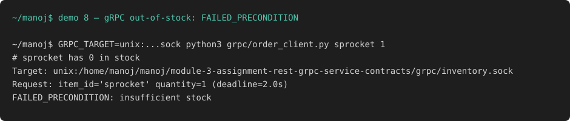
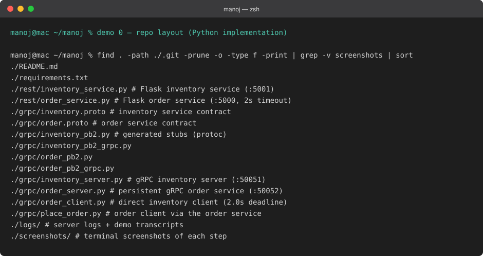

# CMPE 273 — Order/Inventory via REST and gRPC

Manoj Ganjigatte Manjunatha — SJSU ID 020763197

This lab implements the same Order Service → Inventory Service interaction twice:
once over REST/HTTP with JSON, and once over gRPC with Protocol Buffers.
The Python implementation lives in `rest/` (REST version) and `grpc/` (gRPC version).

Inventory data (both versions): `{"widget": 100, "gadget": 25, "sprocket": 0}`.

## How to run the REST version

Install dependencies:

```
pip install -r requirements.txt
```

Terminal 1 — Inventory Service (port 5001):

```
python3 rest/inventory_service.py
```

Terminal 2 — Order Service (port 5000, 2s timeout on inventory calls):

```
python3 rest/order_service.py
```

Send an order:

```
curl -X POST localhost:5000/order -H 'Content-Type: application/json' \
  -d '{"item_id":"widget","quantity":2}'
```

To simulate a slow inventory service, set `INVENTORY_DELAY` (seconds) before
starting it:

```
INVENTORY_DELAY=5 python3 rest/inventory_service.py
```

## How to run the gRPC version

Install dependencies (same requirements file), then generate the stubs
(already generated and committed, but regenerable):

```
pip install -r requirements.txt
python3 -m grpc_tools.protoc -Igrpc --python_out=grpc --grpc_python_out=grpc grpc/inventory.proto grpc/order.proto
```

Terminal 1 — Inventory server (port 50051):

```
python3 grpc/inventory_server.py
```

Terminal 2 — Persistent order service (port 50052, 2.0s inventory deadline):

```
python3 grpc/order_server.py
```

Terminal 3 — Place orders through it:

```
python3 grpc/place_order.py widget 2
```

The one-shot `order_client.py` still works for direct inventory checks:

```
python3 grpc/order_client.py widget 2
```

Slow-inventory simulation works the same way:

```
INVENTORY_DELAY=5 python3 grpc/inventory_server.py
```

Note on this sandbox: its network filter intercepts TCP connections made
through IPv6-mapped sockets, which is how the gRPC Python client connects, so
here the client was run with `GRPC_TARGET=unix:<repo>/grpc/inventory.sock`
(the server also listens on that unix socket; TCP 50051 works normally
outside the sandbox). On a regular machine just run the client as shown above.

## Successful REST request/response

```
~/manoj$ curl -X POST localhost:5000/order -H "Content-Type: application/json" -d '{"item_id":"widget","quantity":2}'
{"item_id":"widget","quantity":2,"status":"confirmed"}

HTTP 201
```



The order service called `GET /inventory/widget?quantity=2`, got
`{"available": true, "stock": 100, ...}` and returned 201 confirmed.

## Request validation

Bad input is rejected before touching inventory — a missing, non-integer,
zero, or negative quantity returns `400`, not `409`:

```
~/manoj$ curl -X POST localhost:5000/order -H "Content-Type: application/json" -d '{"item_id":"widget","quantity":-2}'
{"error":"request must be JSON with item_id (str) and quantity (positive int)"}

HTTP 400
```

The gRPC order service validates the same way, with `INVALID_ARGUMENT`:

```
~/manoj$ python3 grpc/place_order.py widget -3
INVALID_ARGUMENT: quantity must be a positive integer
```

## Successful gRPC request/response

```
~/manoj$ GRPC_TARGET=unix:/home/manoj/manoj/module-3-assignment-rest-grpc-service-contracts/grpc/inventory.sock python3 grpc/order_client.py widget 2
Target: unix:/home/manoj/manoj/module-3-assignment-rest-grpc-service-contracts/grpc/inventory.sock
Request: item_id='widget' quantity=2 (deadline=2.0s)
OK: available=True stock=100 message='2 x widget available (stock=100)'
```



(The `Target:` line shows the unix socket in the sandbox run; on a normal
machine it is `127.0.0.1:50051`. The RPC, deadline and response are identical.)

## REST timeout evidence

Inventory restarted with `INVENTORY_DELAY=5` (longer than the order service's
2s `requests.get(timeout=2)`):

```
~/manoj$ curl -X POST localhost:5000/order -H "Content-Type: application/json" -d '{"item_id":"widget","quantity":2}'
{"error":"inventory service timeout"}

HTTP 504
elapsed: ~2.03s (measured; matches the 2s client timeout)
```

Order service log — the timeout was caught and mapped to 504, not a crash:

```
[2026-10-07 18:33:54.835556] POST /order item=widget qty=2 -> 504 (inventory service timeout after 2s)
```



## gRPC deadline evidence

Inventory server restarted with `INVENTORY_DELAY=5` (longer than the client's
2.0s deadline):

```
~/manoj$ python3 grpc/order_client.py widget 2
Request: item_id='widget' quantity=2 (deadline=2.0s)
DEADLINE_EXCEEDED: inventory service did not respond within 2.0s (details: Deadline Exceeded)
client exit code: 0
```

The `DEADLINE_EXCEEDED` status was handled cleanly and the client exited 0.



## Evidence the Order Service stayed running after the failures

REST: after the 504 timeout, the inventory service was restarted with no delay
and the *same* order service process (PID 1754, started before the failure)
served the next order:

```
~/manoj$ curl -X POST localhost:5000/order -H "Content-Type: application/json" -d '{"item_id":"widget","quantity":2}'
{"item_id":"widget","quantity":2,"status":"confirmed"}

HTTP 201
```



gRPC: after the deadline failure, the inventory server was restarted with no
delay and the next check succeeded:

```
~/manoj$ python3 grpc/order_client.py gadget 1
Request: item_id='gadget' quantity=1 (deadline=2.0s)
OK: available=True stock=25 message='1 x gadget available (stock=25)'
```



The gRPC *order service itself* is persistent too. With the inventory slowed
to 5s, `PlaceOrder` returned `DEADLINE_EXCEEDED`, and the *same*
order-service process served a confirmed order after the inventory was
restarted with no delay:

```
~/manoj$ ORDER_TARGET=unix:.../order.sock python3 grpc/place_order.py widget 2
Target: unix:/home/manoj/manoj/module-3-assignment-rest-grpc-service-contracts/grpc/order.sock
Request: item_id='widget' quantity=2 (deadline=2.0s)
DEADLINE_EXCEEDED: order service did not respond within 2.0s (details: Deadline Exceeded)

~/manoj$ ORDER_TARGET=unix:.../order.sock python3 grpc/place_order.py widget 2
Target: unix:/home/manoj/manoj/module-3-assignment-rest-grpc-service-contracts/grpc/order.sock
Request: item_id='widget' quantity=2 (deadline=2.0s)
OK: status='confirmed' item_id='widget' quantity=2
```



Out-of-stock handling (extra evidence): `sprocket` has 0 in stock.
REST returned `409 {"status":"rejected","reason":"insufficient stock"}`;
gRPC returned `FAILED_PRECONDITION: insufficient stock`.




## REST vs gRPC comparison

The .proto file gave gRPC a single shared contract that both sides compile
from, while REST needed hand-written JSON shapes on each side that can drift.
gRPC's protoc codegen produced typed request/response classes and the stub,
whereas REST was just Flask routes plus `requests` calls with manual
`response.json()` parsing. Errors felt different too: gRPC returns typed
status codes like `NOT_FOUND` and `FAILED_PRECONDITION` through the same
channel as success, while REST maps outcomes onto HTTP codes (404, 409, 504)
that I had to choose and document myself. Both support call deadlines, but
gRPC's `timeout=2.0` is part of the RPC invocation while REST needed the
`timeout=` parameter on the HTTP client, and both surfaced as catchable
exceptions (`DEADLINE_EXCEEDED` vs `requests.Timeout`). Overall gRPC took more
setup (proto file, codegen step, learning status codes) but the contract felt
stricter; REST was faster to write and easier to poke at with curl, at the
cost of the contract living only in prose and example payloads.

## Repo layout



```
rest/inventory_service.py    Flask inventory service (:5001)
rest/order_service.py        Flask order service (:5000, 2s inventory timeout)
grpc/inventory.proto         inventory service contract
grpc/order.proto             order service contract
grpc/*_pb2*.py               generated stubs (protoc)
grpc/inventory_server.py     gRPC inventory server (:50051)
grpc/order_server.py         persistent gRPC order service (:50052, 2.0s deadline)
grpc/order_client.py         one-shot direct inventory client (2.0s deadline)
grpc/place_order.py          order client via the order service
screenshots/                 terminal screenshots of each demo step
logs/                        server logs and captured demo transcripts
```
